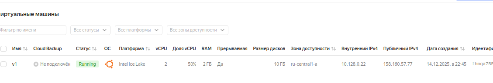
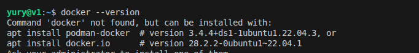
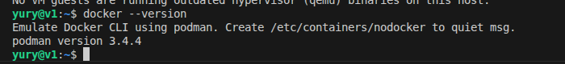
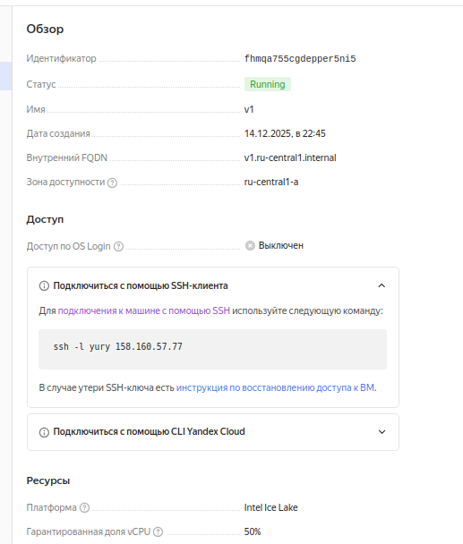

# Домашнее задание к занятию 1.  «Введение в виртуализацию» Шелухин Юрий

   
## Задача 1

1. Создайте через web-интерфейс Yandex Cloud - VPC и виртуальную машину из инструкции конфигурации "эконом-ВМ" с публичным ip-адресом. В пункте "Выбор образа/загрузочного диска" выберите вкладку "Cloud Marketplace" , щелкните "Посмотреть больше", найдите образ "Yandex Cloud Toolbox".
2. Убедитесь, что вы можете подключиться к консоли ВМ через ssh, используя публичный ip-адрес. Убедитесь, что на ВМ установлен Docker с помощью команды ```docker --version```(команду выполните от имени root пользователя) !
3. Узнайте в инструкции Яндекс, какие еще инструменты предустановлены в данном образе.
4. Оставьте ВМ работать, пока она не выключится самостоятельно! Опция "прерываемая" выключит ее не позже чем через 24 часа. 
5. Для наглядности подождите еще 1 сутки.
6. Перейдите по [ссылке ](https://console.cloud.yandex.ru/billing?section=accounts). Выберите свой платежный аккаунт. Перейдите на вкладку детализация (фильтр "По продуктам") и оцените график потребления финансов.
7. Удалите ВМ или пользуйтесь ею при выполнении последующих домашних заданий курса обучения.

**Решение**

1. Создадим виртуальную мащшину. Передачи ей публичный ключ.  
   
 

2. Зайдем на ВМ по SSH.  
`ssh -i /home/yury/HW/terraform/04/secrets/yandex-cloud-key yury@158.160.57.77`


Убедимся, что на ВМ установлен Docker.  
`docker --version`

  

Так как Docker по умолчанию не установлен, установим его самостоятельно.   
`sudo apt install  podman-docker`  

 

3-7. 

 

---


## Задача 2

Выберите один из вариантов платформы в зависимости от задачи. Здесь нет однозначно верного ответа так как все зависит от конкретных условий: финансирование, компетенции специалистов, удобство использования, надежность, требования ИБ и законодательства, фазы луны.

Тип платформы:

- физические сервера;
- паравиртуализация;
- виртуализация уровня ОС;

Задачи:

- высоконагруженная база данных MySql, критичная к отказу;
- различные web-приложения;
- Windows-системы для использования бухгалтерским отделом;
- системы, выполняющие высокопроизводительные расчёты на GPU.

Объясните критерии выбора платформы в каждом случае.

**Решение**

1.  Высоконагруженная база данных MySql, критичная к отказу:
   - Физические сервера (Bare Metal) могут быть лучшим выбором, когда важна максимальная производительность без накладных расходов гипервизора. Это характерно для OLTP-систем с очень интенсивными транзакциями. С другой стороны, физический сервер может стать единой точкой отказа;
   - Облачные сервисы предлагают готовые механизмы для устранения этого недостатка: гибкое масштабирование ресурсов (CPU, RAM, дисковой подсистемы) без простоя и встроенные решения для репликации данных и аварийного восстановления. Управляемые облачные СУБД (например, Amazon Aurora) берут на себя всю работу по обеспечению доступности;
   - Гибридный подход — современный компромисс. Гиперконвергентные системы (HCI) позволяют использовать физические серверы как часть единого легко масштабируемого пула ресурсов с высокой степенью автоматизации отказоустойчивости.
  
2. Различные web-приложения:
   - Виртуализация уровня ОС (контейнеры) — это оптимальный выбор для самих микросервисных приложений. Они обеспечивают легковесную изоляцию и быстрое масштабирование. Однако для оркестрации контейнеров (например, с помощью Kubernetes) требуется виртуальная или физическая инфраструктура;
   - Облачная платформа (IaaS/PaaS) является идеальной базой. Она предоставляет виртуальные машины (паравиртуализация) для развертывания кластеров контейнеров или управляемые сервисы (PaaS), которые позволяют разработчикам размещать код, не думая об инфраструктуре. Автоматическое масштабирование и модель оплаты по мере использования помогают эффективно управлять бюджетом.
  
3. Windows-системы для использования бухгалтерским отделом:
   - паравиртуализация (например, VMware, Hyper-V, KVM). Она позволяет изолировать виртуальные машины друг от друга, что повышает безопасность. Легко создавать резервные копии и восстанавливать системы;
   - облачный IaaS — это современная реализация паравиртуализации. Крупные провайдеры (включая российские) предлагают решения, аттестованные по 152-ФЗ для хранения персональных данных, с гарантированной локализацией данных на территории страны. Это снимает с компании большую часть регуляторной нагрузки. Также облако позволяет легко развертывать виртуальные рабочие столы (VDI), обеспечивая сотрудникам безопасный удаленный доступ.
  
4. Системы, выполняющие высокопроизводительные расчёты на GPU:
   - Специализированные облачные сервисы GPU — это единственный рациональный выбор для большинства проектов. Провайдеры предлагают доступ к кластерам на базе новейших GPU (например, NVIDIA H100), что позволяет оперативно выполнять задачи (обучение моделей ИИ, рендеринг), не вкладывая миллионы в покупку оборудования;
   - Создание собственного физического кластера может быть оправдано только при стабильной, круглосуточной нагрузке в течение долгого времени и при наличии бюджета, экспертизы и возможности быстрой модернизации.

--- 


## Задача 3

Выберите подходящую систему управления виртуализацией для предложенного сценария. Опишите ваш выбор.

Сценарии:
1. 100 виртуальных машин на базе Linux и Windows, общие задачи, нет особых требований. Преимущественно Windows based-инфраструктура, требуется реализация программных балансировщиков нагрузки, репликации данных и автоматизированного механизма создания резервных копий.
2. Требуется наиболее производительное бесплатное open source-решение для виртуализации небольшой (20-30 серверов) инфраструктуры на базе Linux и Windows виртуальных машин.
3. Необходимо бесплатное, максимально совместимое и производительное решение для виртуализации Windows-инфраструктуры.
4. Необходимо рабочее окружение для тестирования программного продукта на нескольких дистрибутивах Linux.

**Решение**

1. VMware vSphere (коммерческая версия). Лидер рынка с лучшей поддержкой Windows, мощными встроенными функциями HA, vMotion, vSphere Replication и богатой экосистемой для бэкапов (Veeam).
2. Proxmox VE. Универсальное бесплатное решение "всё в одном" с удобным веб-интерфейсом, поддержкой KVM и контейнеров LXC, встроенным бэкапом и кластеризацией.
3. Microsoft Hyper-V Server (бесплатный гипервизор) или Hyper-V в Windows Server. Нативная поддержка Windows-гостей и драйверов, идеальная интеграция с Active Directory. 
4. KVM/QEMU с Virt-Manager или VirtualBox. KVM — производительная нативная виртуализация для Linux. VirtualBox — проще в установке и кроссплатформенна, идеальна для десктопного тестирования.

---


## Задача 4

Опишите возможные проблемы и недостатки гетерогенной среды виртуализации (использования нескольких систем управления виртуализацией одновременно) и что необходимо сделать для минимизации этих рисков и проблем. Если бы у вас был выбор, создавали бы вы гетерогенную среду или нет?

**Решение**

  Недостатки.
1. Операционное управление (отсутствие единой панели управления и мониторинга, рутинные задачи требуют работы с несколькими интерфейсами). Решение - стандартизация процессов, внедрение сквозных платформ управления (в т.ч. с открытыми API) и четкое разграничение ответственности между командами.
2. Затраты и ресурсы	(повышенные операционные расходы, потребность в узких специалистах под каждую систему, рост сложности обучения).	Решение - строгий расчет совокупной стоимости владения для обоснования, консолидация виртуальных машин и систем, кроссплатформенное обучение админов.
3. Совместимость и поддержка (трудности интеграции и миграции, проблемы с лицензированием, риск отказа в технической поддержке от вендоров).	Решение - тщательное тестирование совместимости, использование открытых форматов и универсальных платформ для бэкапов и миграции. Четкое согласование с вендорами политики поддержки.
4. Безопасность и производительность	(увеличение поверхности для атак, сложность единой политики безопасности и контроля производительности в разных средах). Решениеиная модель безопасности, микросегментация сети, мониторинг производительности на уровне хостов и гостевых ОС.

Я бы сознательно избегал создания новой гетерогенной среды. Стремление к максимальной стандартизации на одной платформе — путь к управляемости, экономии и безопасности

---